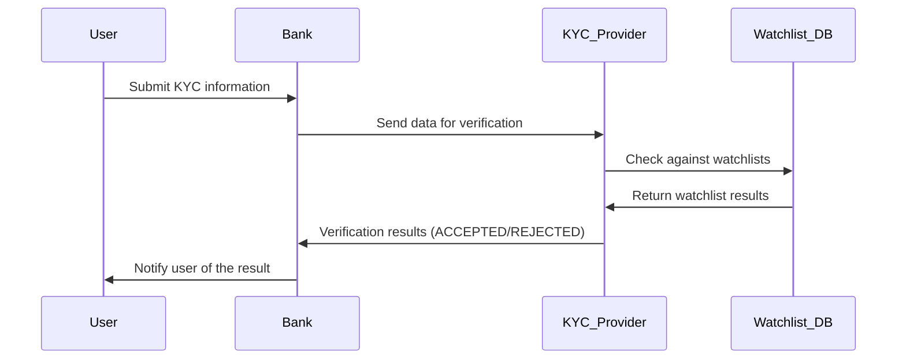
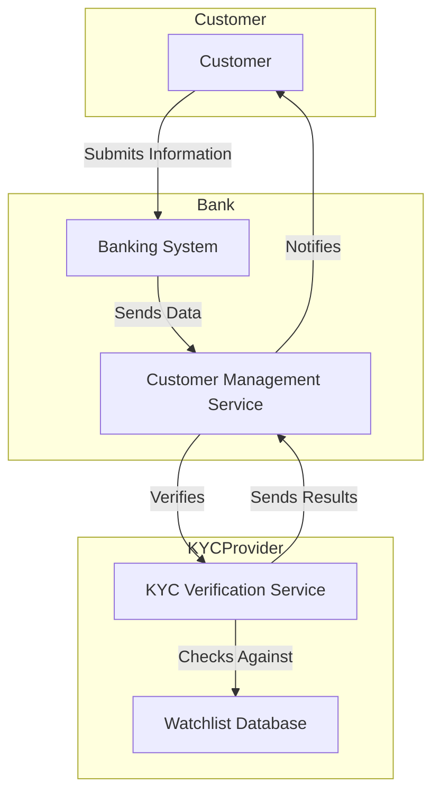
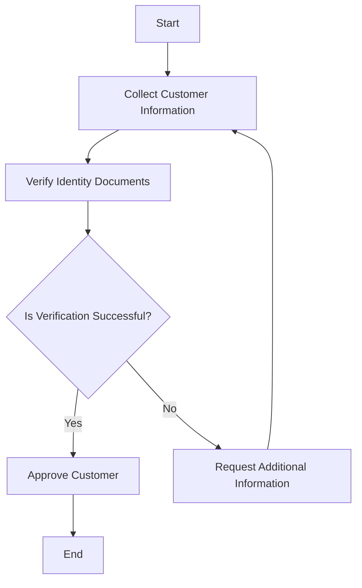
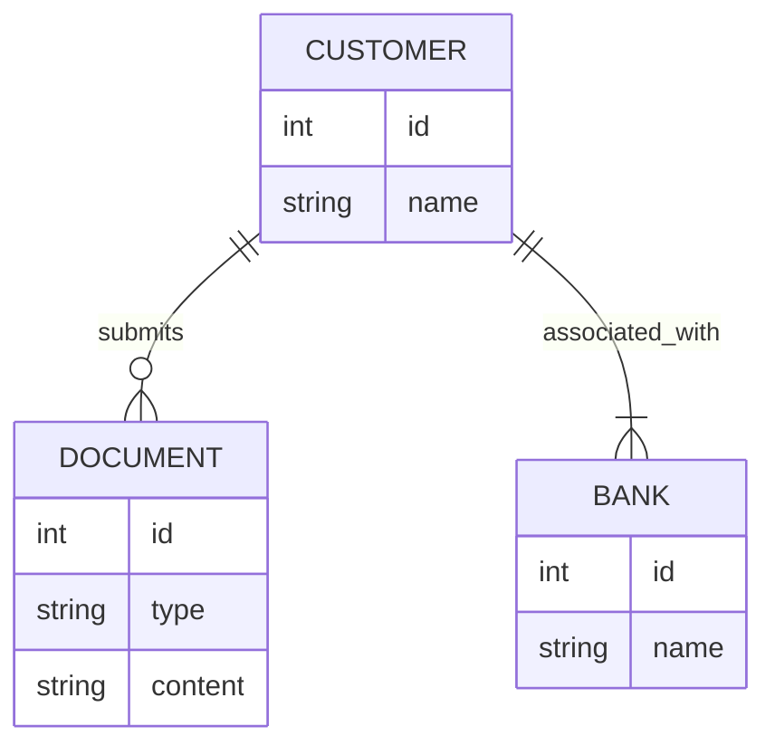

## Introduction

Currently we can see that many companies are trying to embrace with open-source models, one of critical aspects of making this open source is clear and accessible documentation. Software developers, system designers and those managing complex workflows must be able to visualise ideas quickly and simply.
I am a person who likes to see diagrams in documentation; they help me better understand the concepts and, in my opinion, significantly improve comprehension and communication.In this article, I will try to explain my understanding why MermaidJS can help software engineering teams present complex information in a clear and engaging manner. I will present how integrating Mermaid.js into your documentation process can elevate the quality and accessibility of your technical content, ensuring that your team's knowledge is shared efficiently and comprehensibly across various platforms.

## Why I Prefer Mermaid.js for creating Diagrams

The modern version of Mermaid is simple and can be used by both technical and non-technical people. The best thing is that there is a syntax for creating diagrams. It's easy to understand and similar to Markdown. If you are not technical person you can always use [Live Editor](https://mermaid.live/) and honestly its easier than drawing everything from scratch in most popular tools like figma or excalidraw. Another thing is that you can find many integrations and plug-ins with most common tools used in software development. This makes it ideal for anyone, even those without a strong programming background. I've found it to be a reliable tool because it's simple and versatile. It allows you to create a variety of diagrams, such as:

- Flowcharts
- Sequence Diagrams
- Class Diagrams
- State Diagrams
- Entity Relationship Diagrams
- User Journeys
- Gantt Charts
- Pie Charts
- Requirement Diagrams

## Key Benefits of Using Mermaid.js

I believe that Mermaid.js is an excellent tool for creating diagrams through code, which could enhance the quality and efficiency of technical documentation. It provides a systematic way to visualise complex information, which could make it more accessible and understandable.

#### Consistency in Style and Formatting:
Mermaid.js helps to maintain a consistent style and formatting across all documents, which is an important factor in creating a professional look. By ensuring uniformity, documentation can be made clearer and more cohesive, which in turn helps readers to understand and navigate it more easily.

#### Efficiency in Creation and Updates:
The tool is designed to streamline the generation and updating of diagrams, potentially saving valuable time. Its code-based approach aims to simplify the modification of diagrams, making it easier to accommodate changes rapidly and efficiently, which could be particularly useful for dynamic documentation that requires frequent updates.

#### Version Control and Collaboration:
Integration with version control systems like Git has the potential to enhance collaboration and make tracking changes straightforward. In environments where multiple contributors are involved in documentation and development, this feature could be invaluable in ensuring that all changes are properly documented and accessible.

#### Browser Compatibility and Versatility:
Mermaid.js is a highly versatile tool that seamlessly integrates with web browsers, allowing users to embed and view diagrams on a range of platforms, including GitHub, GitLab, and other Markdown-supported environments. This capability expands its utility, making it an ideal choice for various documentation and presentation needs.

In light of the above, it seems fair to suggest that Mermaid.js could be a valuable addition to any visual communication toolkit. It has the potential to streamline workflow efficiency and collaborative efforts, offering a comprehensive framework for creating, managing and sharing diagrams. This could help teams to convey complex ideas with clarity and consistency, ensuring that all project stakeholders have a unified understanding of the information, which in turn could facilitate smoother and more effective communication.

## Example: Understanding KYC with Mermaid.js diagrams

Let's explore different diagrams to visualise the Know Your Customer (KYC) process, which is crucial for financial institutions to verify customer identities, comply with regulations and prevent illegal activities such as money laundering. Using tools such as sequence diagrams, C4 diagrams, flowcharts and class diagrams, we can illustrate the steps involved in KYC. This experiment aims to simplify and illustrate the KYC process for my blog, making it easier to understand these regulatory requirements. Please note that these charts are created quickly and are for exploratory purposes only.

### Here are five examples:

#### 1. Sequence Diagram:

To illustrate the KYC verification process, here’s a sample sequence diagram. KYC is critical in ensuring compliance and fraud prevention in the financial industry:

##### Visual example:

##### Description:

1.	**User Submission:** The customer provides their personal and identification details to the bank. This typically includes identification documents, proof of address, and other necessary information.
2.	**Data Forwarding:** he bank forwards this information to a third-party provider to verify its accuracy and authenticity.
3.	**Verification Against Watchlists:** The KYC provider checks the submitted information against various watchlists to identify any individuals or entities that may be flagged for potential risks, such as fraud or other concerns.
4.	**Watchlist Results:** The results of these checks are sent back from the watchlist database to the KYC provider, indicating whether there are any matches or concerns based on the customer’s information.
5.	**Verification Outcome:** The KYC provider determines the outcome of the verification process, assessing whether the customer has successfully passed or failed the necessary checks.
6.	**Notification to User:** Finally, the bank receives the verification results from the KYC provider and informs the customer of the outcome. If further information is required, the bank will request additional details from the customer.

This sequence diagram provides a clear and structured view of the KYC process, highlighting the roles and interactions of each entity involved. It is an essential tool for understanding how information flows and is processed in a regulated financial environment.

#### 2. KYC C4 diagram example:

A C4 diagram provides a high-level overview of the system architecture involved in the KYC process, highlighting the interaction between various components.

##### Visual example:

##### Description:
This diagram represents the key components and interactions in the KYC system, including the customer, banking system, customer management service, KYC verification service, and watchlist database.

#### 3. Flowchart for KYC Process:
Mermaid code:

##### Visual example:

##### Description:
This flowchart outlines the KYC process, starting from collecting customer information to verifying identity documents and making a final decision on customer approval.

#### 4. Class diagram for KYC

##### Visual example:

##### Description:
- Customer: Represents a person undergoing KYC verification. Each customer has an ID, name, date of birth, and a list of documents. They can submit their information for verification.
-	Document: Represents documents provided by the customer for verification (e.g., passport, driver’s license). Each document has an ID, type, and content. It can be validated as part of the verification process.
-	Bank: Represents the financial institution requiring KYC verification. Each bank has an ID, name, and a list of customers. The bank processes KYC using customer information.
-	KYCProvider: Represents a third-party service that verifies documents and checks them against watchlists. Each provider has an ID, name, and service type. They perform document verification and watchlist checking.
-	Watchlist: Represents databases of flagged individuals or entities. The watchlist has an ID, name, and description and is used by the KYCProvider to check for any matches.

This class diagram provides a structured view of the KYC system, showing how different entities interact and their roles in the KYC process.

## Leveraging Integrations and Community Support with Mermaid.js

Mermaid.js benefits from a strong ecosystem and community support, as highlighted on its integrations and community page. This robust ecosystem includes integrations with numerous platforms and tools, making it versatile and accessible across different workflows:

- **GitHub and GitLab:** Both platforms support native integration of Mermaid.js, allowing diagrams to be rendered in Markdown files, project documentation, and pages. This makes it easier for teams to visualize code structures, workflows, and project designs directly within their repositories.
- **Obsidian:** Plugins available for incorporating diagrams into Markdown notes, enhancing note-taking with visual elements.
- **Confluence and Jira:** Add-ons that enable embedding diagrams directly into documentation and issue tracking, improving project clarity and communication.
- **Slack:** Supports embedding diagrams in messages, helping teams visualize processes and workflows in real-time discussions.
- **Notion:** Integration allows for the inclusion of diagrams in Notion pages, aiding in the organization and presentation of information.

The community-driven nature of Mermaid.js ensures that it continuously evolves to meet the needs of its users. This open-source project encourages contributions from developers worldwide, fostering an environment of innovation and improvement. The community also offers extensive resources, including tutorials, forums, and user-contributed examples, making it easier for newcomers to get started and for experienced users to discover advanced features. As an open-source tool, Mermaid.js benefits from a vibrant community that continuously enhances its features, keeping it aligned with current trends and user needs. This open nature facilitates seamless integration into various platforms, including documentation websites, wikis, and project management tools, supporting collaboration and efficiency in team environments.

Additionally, the active community around Mermaid.js provides a platform for users to share ideas, troubleshoot issues, and stay updated on the latest developments. This collaborative spirit helps maintain a dynamic ecosystem that supports a wide range of use cases, from simple flowcharts to complex system diagrams.

## Conclusion

Mermaid.js is a great tool for creating technical documentation. Its simple syntax and easy integration make it the best choice for creating clear, consistent, and up-to-date diagrams. Mermaid.js helps you document software, business processes and project schedules. It makes complex information accessible and accurate.

Mermaid.js is useful even though it is easy to use. It transforms the documentation process, encouraging collaboration and establishing a shared source of truth, making it more efficient and accurate. It's a big deal for teams and individuals to be able to quickly produce high-quality documentation.

Over the years, I've used many tools, including Pencil Project, PowerPoint, UX Pin, draw.io, Excalidraw, Figma, and Miro. These tools have their uses, but none can match the precision and flexibility of coding diagrams with Mermaid.js. Being able to make changes with engineers in real time saves time and makes the documentation better.

If I had used Mermaid.js sooner, I would have saved a lot of time. It is very efficient and simple to use, which makes it a must for anyone who writes technical documents. If you haven't tried it, you are missing out on a great way to keep your documents up to date.

<b>Useful Links</b>
- [Mermaid docs](https://mermaid.js.org/intro/)
- [Mermaid Visual Editor](https://mermaid.live/edit#pako:eNpVjkFqw0AMRa8itGohvoAXhcZuswm00KxqeyFs2TMkMxrkMSHYvnvHTQutVhLv_Y9mbKVjzLG_yLU1pBFOZe0hzXNVGLVjdDQ2kGVPy4EjOPF8W2D_cBAYjYRg_fB49_ebBMV83DSGaKw_r3dUfOffPC9QVkcKUULzl5yussBLZd9Nqv9PjHJKvVY95T1lLSkUpA3u0LE6sl16fd4CNUbDjmvM09qRnmus_Zo8mqJ83HyLedSJd6gyDQZT2WVM1xQ6ilxaGpTcrxLIf4q4H2n9Ai2vXtE)
- [Mermaid GitHub](https://github.com/mermaid-js/mermaid)
